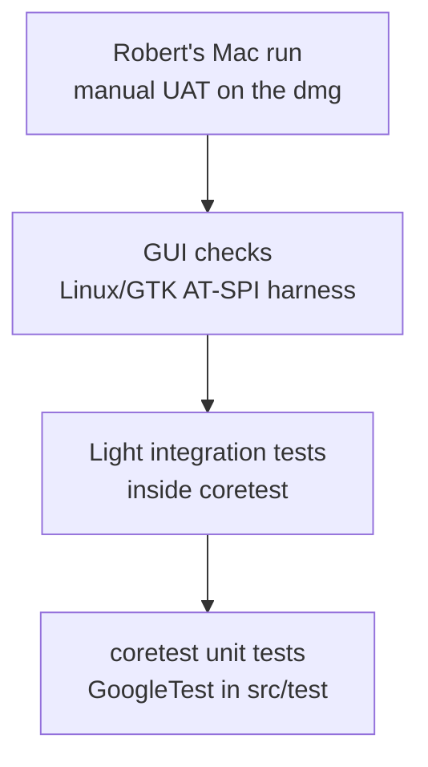

# Test strategy: rjbarbour/pwsafe fork

**Status: draft.** Awaiting Robert Barbour's approval (PWS-22 AC 14). Open points: Grace Hopper owns the coverage runner and compiler (AC 3; the move lands in PWS-23 once she confirms); Robert Barbour owns the macOS coverage choice (AC 9).

This is the fork's test policy for implementers, reviewers and QA. New code under the measured tree must meet 100% line, branch and condition coverage, with parameter and boundary tests, unit tests, automated UAT, and light integration tests only around key interfaces. There is no obligation to raise coverage of existing code. Gates that enforce the bar are implemented elsewhere (PWS-07, PWS-18, PWS-23); this document defines the policy only.

## 1. Test pyramid

| Level | What belongs here | Who / what runs it | Platforms |
|---|---|---|---|
| Unit (coretest) | Pure logic, policies, prefs behaviour, fail-closed paths, parameter and boundary cases | `coretest` (GoogleTest under `src/test`), via `ctest -R Coretests` or the `coretest` binary | Linux (CMake in `cmake-build.yml`; coverage in fork-only `fork-quality.yml`); macOS (`macos-latest.yml`, `macos-cmake-latest.yml`) |
| Light integration | Wiring across a small number of already-tested units (see §7) | Same `coretest` run as unit tests | Same as unit |
| GUI checks | Dialog behaviour and dialog→core wiring, traced to a task's acceptance criteria | QA harness at `/workspace/qa-dialog-check` (**off-repo**, a known limit logged as RAID R-12; AT-SPI / pyatspi under Xvfb; fresh scratch home per run so `pwsafe.cfg` starts at first run) | Linux/GTK only |
| Robert's Mac run | User-visible UI and platform-native behaviour before merge | Robert Barbour, from the `PasswordSafe-macOS*.dmg` in the artefact named `PasswordSafe-macOS.<sha>` uploaded by `macos-latest.yml` | macOS only |

Most new behaviour is proved at the bottom. GUI checks confirm the dialogs wire to that behaviour. The Mac run covers what Linux cannot see.

## 2. New-code coverage bar

**Bar:** 100% line, branch and condition coverage of new code.

**New code:** the lines a pull request adds or changes against its merge base (whole new files, plus changed lines in existing files).

**Measured tree:** code that coretest instruments — `src/core`, `src/os/unix`, and the shared files directly under `src/os` (for example `file.h`, `typedefs.h`). `tools/quality/coverage.sh` already filters on all of `src/os/` (and `src/core/`); vendored `src/core/pugixml` and `src/core/crypto/external` are excluded. See §5 for files that are not measured.

### How each metric is measured

| Metric | Tool and command | Report field / note |
|---|---|---|
| Line | gcovr 8.6 via `tools/quality/coverage.sh` (`--json`, Cobertura, text summary); changed-line line hits may also be checked with diff-cover | gcovr JSON per-line `count` |
| Branch | same gcovr run, with `--exclude-throw-branches` and `--exclude-unreachable-branches` (see §4) | gcovr JSON per-line `branches` |
| Condition | same gcovr run after a GCC 14+ build with `-fcondition-coverage` | gcovr JSON per-line `conditions` (`conditionno`, `count`, `covered`, `not_covered_false`, `not_covered_true`); gcovr passes `gcov --conditions` when the gcov tool supports it ([gcovr 8.6 JSON output](https://gcovr.com/en/8.6/output/json.html); [gcovr FAQ — gcov options](https://gcovr.com/en/stable/faq.html)) |

diff-cover can enforce changed-line **line** coverage only. **PWS-07** owns the line-coverage gate on changed lines (`gate_changed.py`, and may use diff-cover). **PWS-23** owns branch coverage on changed lines, condition coverage once the PWS-23 runner puts condition data in the report, and the reviewed exemption file under `tools/quality/` (it extends `gate_changed.py` from PWS-07 for those checks).

### Runner and compiler (open point — Grace Hopper)

Condition coverage needs **GCC 14 or later** (`-fcondition-coverage`). The current coverage job in `.github/workflows/fork-quality.yml` runs on `ubuntu-latest` (today ubuntu-24.04) with **GCC 13** (configure log of run 37787860322 shows GNU 13.3.0).

Grace Hopper's recommendation (2026-10-08): move the coverage job to the **`ubuntu-26.04`** runner (GCC 15.2), add `-fcondition-coverage`, use a gcovr that reports conditions, and re-take the coverage baseline once after the move. That move is part of **PWS-23** once she confirms. Until she confirms the runner and compiler, this remains an **open point owned by Grace Hopper**.

## 3. Boundary and parameter policy

Every new function with a numeric or enumerated input is tested at each boundary and just outside it, and with a parameterised test over each equivalence class.

**Worked example — PWS-02 word-count clamp.** Limits `kMinPassphraseWords` and `kMaxPassphraseWords` are defined once in `Passphrase.h`. Both the `PWSprefs` preference table and the core clamp `ClampPassphraseWords` use those constants. Tests derive the boundary cases (min−1, min, max, max+1) from the constants; `PWSprefsTest` asserts that the preference table's min and max equal them. For the current 1..99 range that is 0, 1, 99 and 100, plus a parameterised sweep of below / in / above range.

For an enumerated input: every defined value, plus one invalid value.

## 4. Branch exclusions in the coverage report

The branch measure uses gcovr's:

- `--exclude-throw-branches`
- `--exclude-unreachable-branches`

**Why:** those are compiler-generated exception and unreachable branches that cannot be exercised meaningfully from tests. Without them the 100% branch figure is noise.

Condition coverage is not affected by these options. gcovr does not report how many branches it excluded, so the coverage job computes and prints that count (§11 row 4) so every report means the same thing.

Beyond the vendored-directory filters in §2, no other coverage exclusions are used. Any exemption is a reasoned entry in a reviewed file under `tools/quality/` (**PWS-23**), only for judgement calls in modified measured files (`src/core`, `src/os/unix`, or shared files directly under `src/os`) — never a standing list of UI files.

## 5. What the coverage bar does and does not measure

The 100% bar applies only to the measured tree in §2.

**Not measured.** The coverage report lists these changed files rather than leaving them out silently:

| Path | Label in the report |
|---|---|
| `src/ui`, `src/os/mac` | not measured (GUI or platform wiring, reviewed by hand) |
| `src/os/windows` | not measured (not built in fork CI) |

The strategy must not be read as if GUI or platform code meets the 100% bar.

**Missing-file rule.** A changed measured `.c` or `.cpp` file (under `src/core`, `src/os/unix` or directly under `src/os`) that is missing from the coverage report fails the gate. A changed measured `.h` that is missing is listed as "not in coverage report: no executable code, confirm in review", and both code reviewers (Fred Brooks and Dennis Ritchie) confirm that its new or changed lines add only declarations, constants and trivial accessors. A header whose **new or changed lines** add a real branch or condition (inline function, template, class body) is a gate failure and goes back to move that logic into a measured `.cpp`. Logic already in an upstream header is existing code and carries no obligation (§10).

## 6. Layering policy (testability)

New decision logic lives in `src/core`, or in `src/os` code that the Linux coretest build compiles (`src/os/unix` and the shared files directly under `src/os`). `src/ui` and `src/os/mac` hold thin wiring only. That is what makes the 100% bar reachable without driving the GUI.

New decision logic is defined in a measured `.c` or `.cpp` file; new headers carry only declarations, constants (`constexpr` is fine) and trivial accessors. Example: `Passphrase.h` declares `GenerateMakesPassphrase` and `ClampPassphraseWords`, with bodies in `Passphrase.cpp`, and `kMinPassphraseWords`/`kMaxPassphraseWords` as `constexpr int`.

**Allowed:**

- The dialog makes the existing Default Policy comparison and passes the result to `GenerateMakesPassphrase(useLocalPolicy, entryOnSafeDefault)` in `Passphrase.h`, then acts on the answer.
- The word-count clamp lives in core as `ClampPassphraseWords`, with limits `kMinPassphraseWords` / `kMaxPassphraseWords` defined once in `Passphrase.h` and used by both the `PWSprefs` table and the clamp (see §3).

**Disallowed:** the dialog itself branching on the switch and the policy to decide whether to make a passphrase, or clamping the word count in the dialog. The same rule applies in `src/os/mac`: no decision logic that belongs in core.

GUI checks and Robert's Mac run exercise the wiring; they do not substitute for coretest coverage of the decision.

## 7. Light integration tests

Integration tests are warranted **only around key interfaces, to confirm wiring**. They are not used to reach coverage of logic that belongs in unit tests.

Interfaces that qualify in this codebase (all inside coretest):

- V3 save/reload carriers (for example `FileV3Test`)
- `PWSprefs` ↔ `pwsafe.cfg`
- Passphrase generation ↔ the injected `PWSrand` draw (and injected word list where used)

coretest does not build the dialogs, so dialog→core wiring is checked at the **GUI-checks** level (§1, §8), not here.

## 8. Automated UAT and Robert's Mac run

**Automated UAT** for this fork means the Linux/GTK GUI checks. They live **off-repo** under `/workspace/qa-dialog-check` (RAID R-12), are driven with AT-SPI (pyatspi) under Xvfb on their own display and D-Bus session, and use a **fresh scratch home per run** (`mktemp -d`, with matching XDG paths). `pwsafe.cfg` is absent at the start of the run. The task notes record the scratch path used. QA runs them per task; each check is traced to that task's acceptance criteria (including dialog→core wiring). Screenshots may be taken for layout. The harness does not modify the git tree.

**Robert Barbour's Mac run** is required for any user-visible UI change before he decides on the merge, and specifically for platform-native behaviour:

- native spin-control events (typed value without arrows)
- macOS location of `pwsafe.cfg` (the run names the file it checked)
- clipboard clearing on minimise
- a cheap screenshot for layout

It is run from the `PasswordSafe-macOS*.dmg` in the GitHub Actions artefact named `PasswordSafe-macOS.<sha>` uploaded by `.github/workflows/macos-latest.yml` (not the `passwordsafe-*.dmg` from `macos-cmake-latest.yml`). The result is recorded in the task notes with date, build/commit, what was checked, and the result.

## 9. macOS-only code coverage (open point — Robert Barbour)

The macOS workflows run coretest but measure no coverage today.

Two options:

| Option | What it does |
|---|---|
| **(a)** Fork-only macOS coverage job | Runs only when a pull request changes `src/os/mac`; uses Apple clang / llvm-cov |
| **(b)** Not measured | Listed in the report as not measured; reviewed by hand by both code reviewers (Fred Brooks and Dennis Ritchie) plus Robert's Mac run |

**Recommendation (Edsger Dijkstra): (b).** The layering rule keeps decision logic out of `src/os/mac`, so there is little to measure; the Mac workflows already run the full coretest; and (a) adds a second toolchain for a job that would rarely trigger. If a pull request ever needs real logic in `src/os/mac`, that is a design exception and the trigger to add (a).

Until Robert chooses, this is an **open point owned by Robert Barbour**. His answer is recorded in the PWS-22 task notes.

## 10. Existing code

Existing code carries **no obligation** to raise coverage. When a pull request changes existing lines, its notes state which changed lines are covered and why any are not, and both code reviewers (Fred Brooks and Dennis Ritchie) accept that.

## 11. Gate map

Policy → check → blocks or advises → workflow → implementing task.

| Policy | Check | Blocks / advises | Workflow | Implementing task |
|---|---|---|---|---|
| 100% line coverage on changed lines | `gate_changed.py` (and may use diff-cover) fails when any changed measured line is uncovered. Raising PWS-07 AC 2 from 80% of changed lines to 100% is a separate tracker change by Margaret Hamilton after Robert approves this document | Blocks | `.github/workflows/fork-quality.yml` | **PWS-07** |
| 100% branch coverage on changed lines; condition once condition data is in the report | `gate_changed.py` reads gcovr JSON for uncovered branches (and conditions once row 2 puts them in the report) on changed measured lines | Blocks | `fork-quality.yml` | **PWS-23** |
| Condition coverage enabled in the report | Build with `-fcondition-coverage`; gcovr JSON `conditions` populated; runner/compiler move once Grace confirms | Blocks once the bar is live (report must carry the data the gate reads) | `fork-quality.yml` + `tools/quality/coverage.sh` | **PWS-23** |
| Coverage accuracy (suspicious hits counted) | `--gcov-suspicious-hits-threshold` in `coverage.sh` | Advises accuracy of the report the gate reads | `fork-quality.yml` + `coverage.sh` | **PWS-18** |
| Throw / unreachable branch exclusions | `--exclude-throw-branches`, `--exclude-unreachable-branches`; job computes and prints the excluded-branch count | Blocks (defines what 100% branch means) | `coverage.sh` | **PWS-23** |
| Not-measured labelling | Report lists changed `src/ui` / `src/os/mac` / `src/os/windows` files as not measured with the reason in §5 | Blocks if omitted silently | `fork-quality.yml` / gate script | **PWS-23** |
| Missing measured file fails | Missing changed measured `.c`/`.cpp` → fail; missing changed measured `.h` → list for review confirmation, or fail if it holds a real branch or condition (§5) | Blocks | `fork-quality.yml` / gate script | **PWS-23** |
| Judgement exemptions | Reasoned entry in a reviewed file under `tools/quality/`, modified measured files only | Blocks misuse (no standing UI exclude list) | `tools/quality/` | **PWS-23** |
| Mac coverage if Robert picks (a) | Fork-only macOS coverage job on `src/os/mac` changes | Blocks when that job is required | new `fork-*.yml` | **New task** |
| Mac coverage if Robert picks (b) | Hand review + Mac run; not-measured label | Advises (review and Mac run recorded in notes) | none (process) | No gate task; recorded under AC 9 / task notes |
| Automated UAT (GUI checks) | QA harness run traced to ACs | Advises (evidence in task notes); does not replace coretest | off-repo harness | Per feature task (no separate gate workflow) |
| Robert's Mac run | Notes: date, build/commit, checks, result | Advises merge decision | `macos-latest.yml` artefact | Per feature task |

This document does not implement any of those gates.
